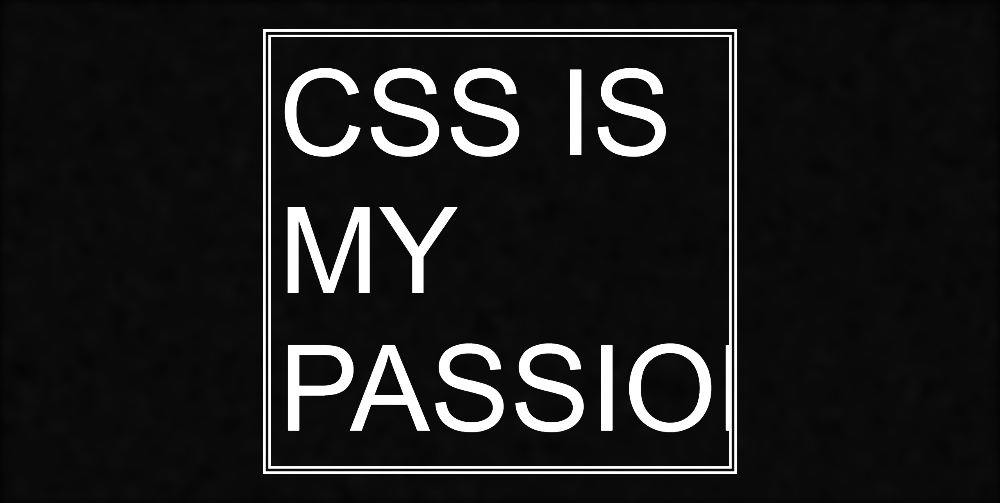

# Future Acronyms - CSS is my passio
**A 9kb [intro](https://en.wikipedia.org/wiki/Demoscene) for the web, written in TypeScript and SCSS.**

## Stuff included

- A music engine, inspired by MIDI and trackers. All sounds are generated using the Web Audio API.
- A primitive visual "digital audio workstation" to create note / drum data for the music engine. Uses TypeScript, React and Styled Components.
- A custom Parcel plugin to minify & compress the JS bundle using [Roadroller](https://github.com/lifthrasiir/roadroller).
- The demo itself, written in TypeScript and SCSS. All graphics are generated with DOM elements and CSS animations - no pre-made or external assets, no SVG, no canvas*, no WebGL.

* One off-screen canvas is used once to generate a noise texture, which is used for several effects.

## Instructions

Make sure recent verions of Node.js and Yarn are installed.

Both the demo and the music engine require a recent version of Google Chrome to run. I was planning to support Firefox as well, but unfortunately it doesn't support all of the APIs I need. Most notably it doesn't support `cancelAndHoldAtTime` in the Web Audio API, which I use in some of the instruments. It also doesn't support CSS `@property` declarations yet, which I use for fancy CSS animations.

Install dependencies with `yarn`. To run the demo in development mode, use `yarn start`. To build the 9kb "production" version, use `yarn build`. To run the music editor, use `yarn start-daw`.

## License

See [license.md](./license.md).
